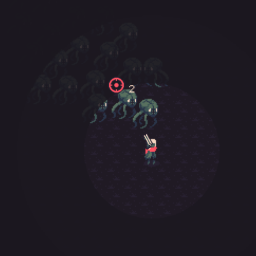

# StarlessNight
A [BepInEx](https://github.com/BepInEx/BepInEx/releases) plugin for [20 Minutes Till Dawn](https://store.steampowered.com/app/1966900/20_Minutes_Till_Dawn/).

## Nexus [link](https://www.nexusmods.com/20minutestildawn/mods/16)
## Feature

- Makes the fog of war darker
- XP orb don't emit light
- Other source of light remained for now (fire, bosses, bullet impacts)




## For modders

- Clone the project
- Open repo in VSCode
- Setup $GameDir variable in *StarlessNightMod.csproj*
- ```dotnet build``` to build and deploy mod
- ```dotnet publish``` to publish a .zip file
